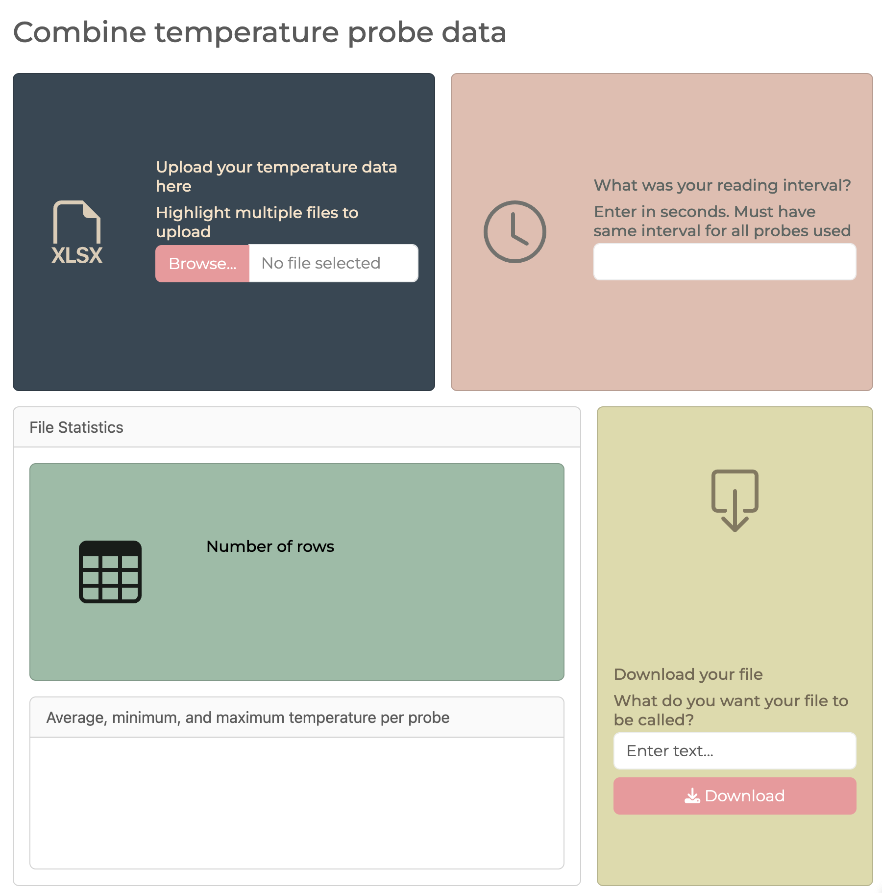
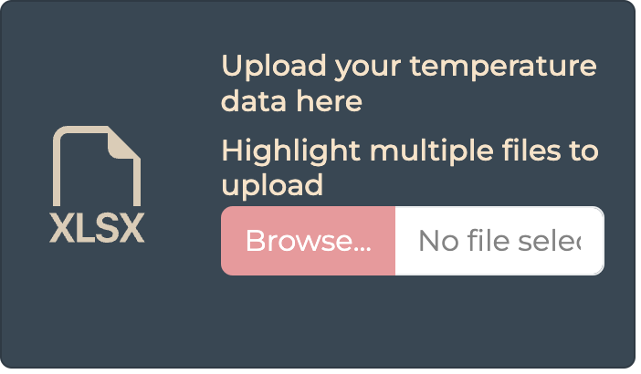
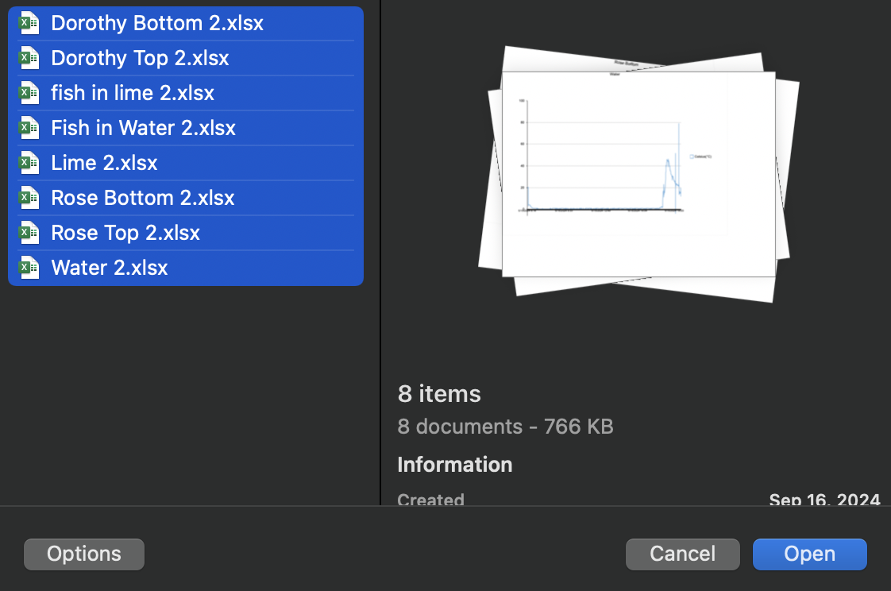
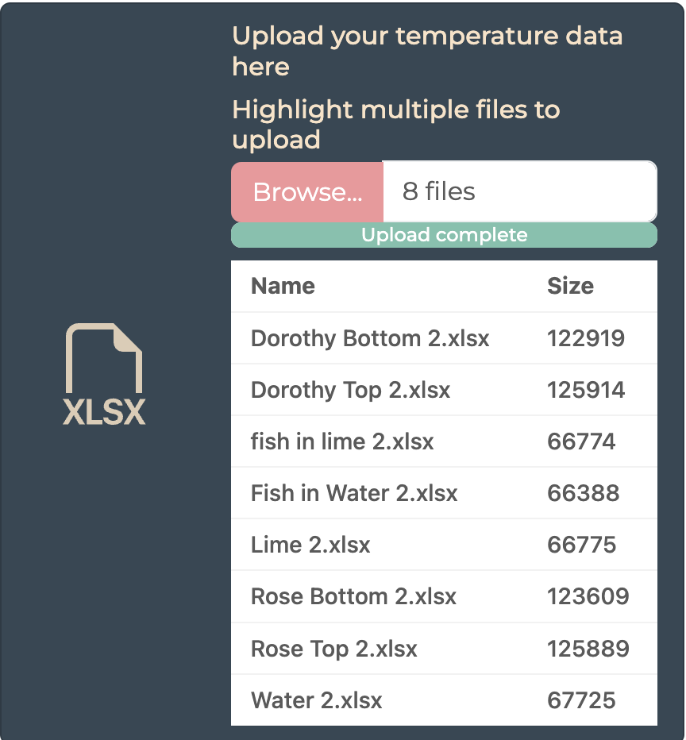
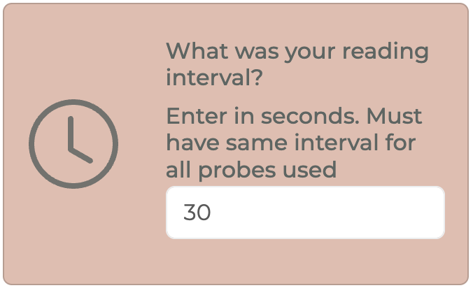
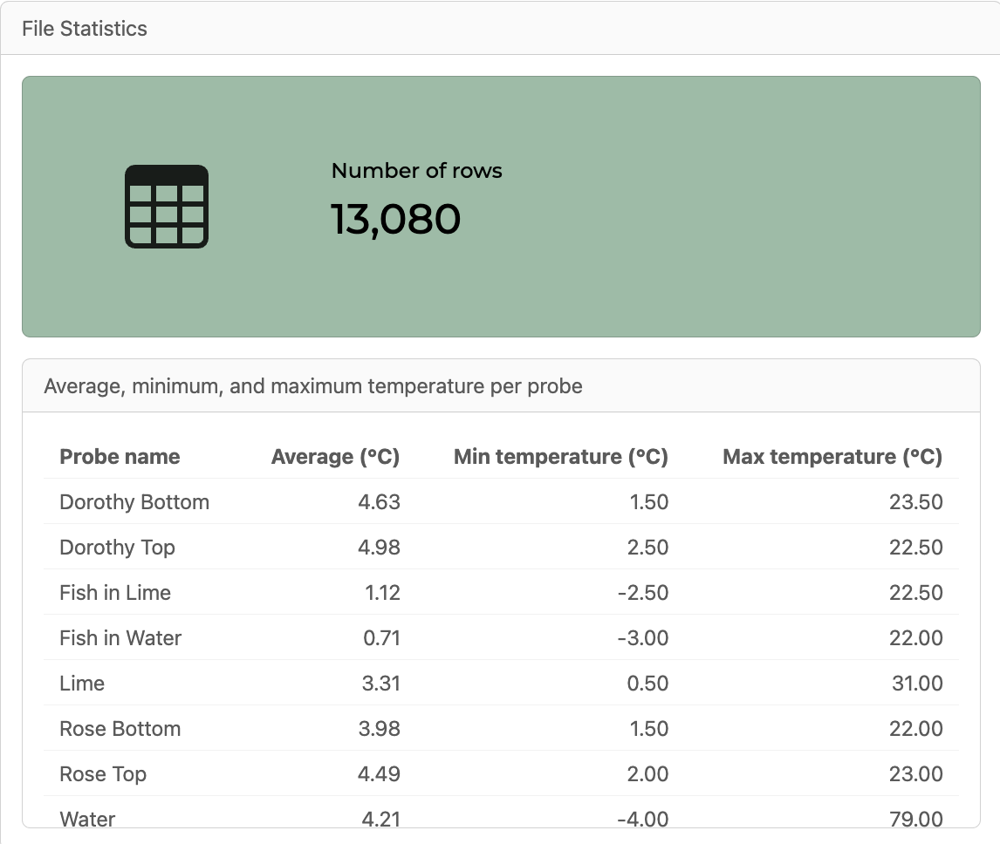

# temp_probe_formatrr

This app and associated script is for collating multiple temperature probe .xlsx files into one. This is specifically for temperature probes set up using the EasyLog USB software. Our lab uses the EasyLog EL-USB-2-LCD style data loggers. Some of our probes can read relative humidity and dew point while others don't. This app can take any number of xlsx sheets from the probes and collates them, regardless if it is the type of probe that can read humidity or not.

There is a standalone R Script that accomplishes this, but only on the probes that also read humidity and dew point (temp_probe_formatrr_nonGUI.R). I initially made this script as a starting point for the app.

I made the shiny app for my lab mates that either aren't comfortable with R or just don't want to mess with it. This will hopefully be a huge time saver for them and be kinder on their computers :)

**Example data that I used to develop the app is available in the Data folder.**

[**Link to app**](https://ahrouj-andrea0domen.shinyapps.io/temp_probe_formatrr/)

## How to use

### 1. Open the app

Either run the app.R script or visit the website. This is what you should see:

### 2. Upload your data

Using the dark blue upload box, click browse and highlight all of your temperature probe files to upload. These sheets should be the raw exports from EasyLog. 

When complete, a list of your files and their sizes will show. 

### 3. Enter your interval

After the files are uploaded, use the second box to enter the interval you used on your probes. **This is entered in seconds**. 

If you used different intervals for different sets of probes, group them by said interval. 

For example, if you had 5 probes reading every 60 seconds and 5 probes reading every 30 seconds, group the 60 second probes together and run through the app. Then run the 30 second group.

### 4. Check the stats

Once the interval is entered, the app will display the number of rows of the final collated file in addition to the average, min, and max temperatures of each probe. Make sure this data makes sense!

### 5. Download your data

If everything looks fine and dandy, use the final download box to give your collated file a name and click download. Note that if a probe that can't read relative humidity and dew point is used those cells will be blank in the final file.

